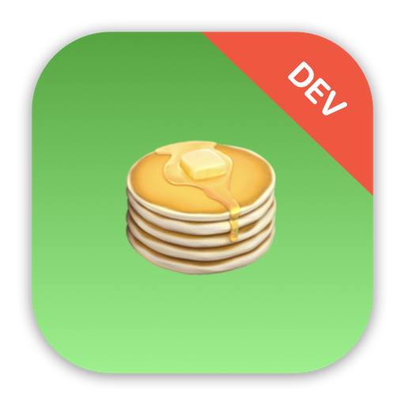

    

<h3 align="center">treats.</h3>

    
    
    

  ***Note**: The app icon above should only be used for development purposes only, not for submission to the App Store due to the license on SF Symbols and Emoji.*

 

Treats is a food-ordering app that lets you place orders for appetizers. It comes with an account and order screen where you can edit & save your user details and view your order summary of all item(s) added to order.

Overall, it's functionality is fairly straightforward where you can view a list of food items and tap on each one to view its details, such as a description, nutritional information, and price. You can also add the food item to order through each of their detail pop-up component.

All information of the food items such as images, descriptions, prices, etc., are retrieved from an API through making network calls to fetch its JSON data and decoding them to display on screen. Caching of the food images on local device memory are also implemented for faster, subsequent loading of the app. To refine the UX, a loader was implemented with the use of `ProgressView` to indicate to the user that the data is being retrieved and decoded for display on-screen.

Item(s) added to order are shown in the order view where you can see a summary of your order; a list of all item(s) added and total price of your order. In the order view, you can also removed any item(s) you've added simply by swiping slightly left on each food item to display the delete button. You can also use a drag gesture by swiping an item all the way left across the screen. If you have any existing item(s) in the order view, you can also find a button here to place your order. If there are no item(s), an empty view will be displayed showing you that there no items in your order. For simplicity and the personal educational scope of this project, the functionality of the "Place Order" button is not implemented in this app.

For you to save your details & preferences, simply navigate to the account view in the bottom tab bar and fill in your details such as name, email address, birthdate & more. All user details are saved & retrieved locally on device through the use of encoding & decoding to & from `@AppStorage`, all in complete privacy with no data persistance to external databases.

#### - Key features & technologies

* iOS 15+ button system w/ SF Symbols
* Adaptable color themes between light & dark mode
* MVVM (Model-View-ViewModel) Design Pattern
* Image-caching of food item images for faster loading
* JSON data-fetching through network calls to an API to retrieve the food details
* Local data persistence & retrieval of user account info & preferences to & from `@AppStorage`   
* 3 view screens for users to switch in-between: 
    * A food item menu list screen for viewing food details & adding to order
    * An account screen for editing & saving user details & preferences
    * An order screen for viewing a summary of all item(s) added to order

## App preview

    
    
    
    
    
    

https://user-images.githubusercontent.com/65307853/189212063-f9719cab-98f7-4cbe-b2f7-4aa4bfdd8930.mp4

## Trying it yourself

Treats is written using Xcode 13.2 and Swift 5.5 on the SwiftUI framework. To try it out, you can clone this project and build it immediately by opening `Treats.xcodeproj`.

As far as I know the app feature is complete, but there are always the likelihood of errors popping up once in a while due to a number of reasons; code deprecation, breaking changes due to new SwiftUI version releases, etc. 

If you hit any problems, either building or running the app, please let me know.

## Important notes on usage

Keep in mind that the Treats app is a project designed and built for my own personal education purposes and serves as a reference point for my future projects. This app project was to gain practical experience in building an app on the iOS platform with Swift & SwiftUI. The state of this app was never meant to be production-ready, published onto the App Store, or to be monetized in any way, shape, or form.

If you wish to do any of the above, you will have to make some changes to the app before submitting to the App Store for approval. Please keep in mind of any potential violation of third-party license, such as, but not limited to, the usage of SF Symbols in the app icon.

## Credits

Swift, the Swift logo, Xcode, Instruments, SF Symbols, Emoji, Cocoa Touch, iPhone, iPad, Safari, App Store, watchOS, tvOS, Mac and macOS are trademarks of Apple Inc., registered in the U.S. and other countries.

## License 

This project is licensed under the terms of the MIT license. For more information, please refer to the license [documentation](LICENSE).
